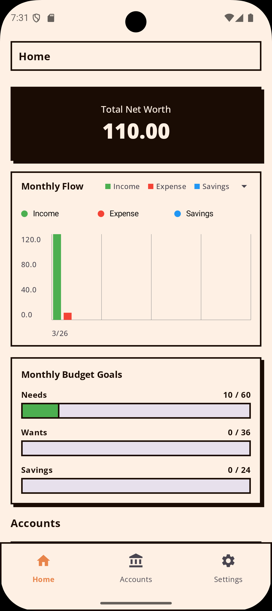
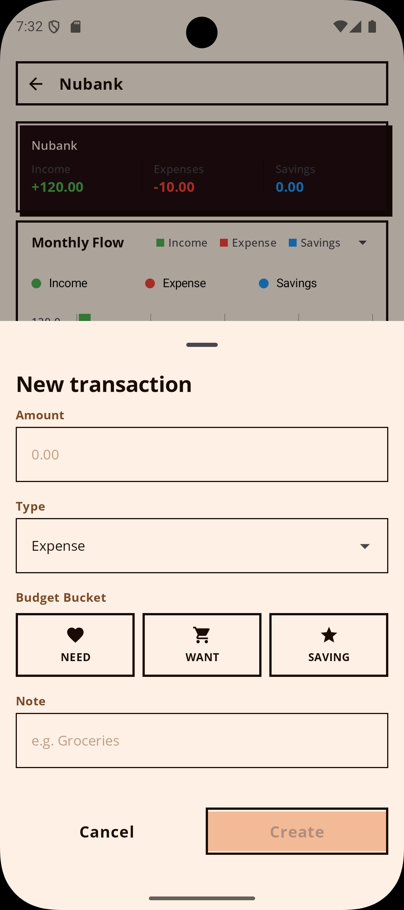
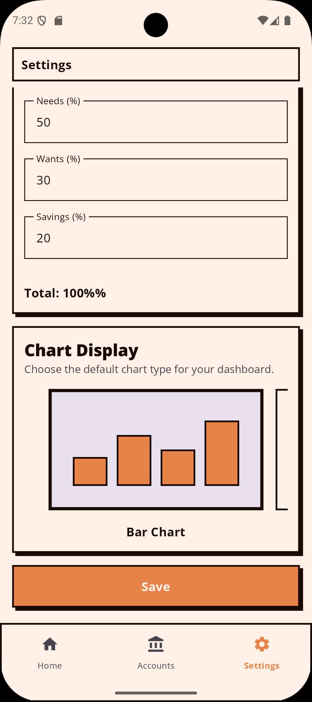

    

# DFinance

    
    
    
    

Local and ad-free finances app that can be used anywhere.

## The 50/30/20 Philosophy

DFinance is built around the 50/30/20 budgeting rule, originally popularized by Elizabeth Warren and
Amelia Warren Tyagi. Instead of micromanaging every single coffee purchase with dozens of
categories, your income is simply split into three actionable buckets:

* **50% Needs:** The non-negotiables (rent, groceries, utilities).
* **30% Wants:** The fun stuff (dining out, hobbies, subscriptions).
* **20% Savings:** Paying your future self (investments, emergency funds, debt payoff).

## Previews

  
  
  

